# Laravel Test Technique

Application de gestion de réservations immobilières construite à partir du squelette créé avec :

```bash
composer create-project laravel/laravel laravel-test
```

Le projet a ensuite été enrichi pour couvrir un cas complet de réservations de biens immobiliers avec espace client, panneau d'administration Filament, module de réservation Livewire et personnalisation du profil utilisateur.

## Objectif du projet

Le site permet de :

- consulter un catalogue public de biens immobiliers ;
- ouvrir la fiche détaillée d'un bien ;
- réserver un bien via un module Livewire ;
- consulter, gérer et annuler ses réservations depuis un espace utilisateur ;
- administrer les biens, les clients et les réservations depuis un panneau Filament.

## Dépendances ajoutées

### Dépendances PHP principales

- `laravel/framework:^13.0`
- `laravel/tinker:^3.0`
- `livewire/livewire:^4.2`
- `filament/filament:^5.4`

### Dépendances de développement

- `laravel/breeze:^2.4`
- `fakerphp/faker:^1.23`
- `laravel/pail:^1.2.5`
- `laravel/pint:^1.27`
- `mockery/mockery:^1.6`
- `nunomaduro/collision:^8.6`
- `phpunit/phpunit:^12.5.12`

### Dépendances front

- `tailwindcss`
- `@tailwindcss/forms`
- `vite`
- `laravel-vite-plugin`
- `alpinejs`
- `axios`
- `concurrently`

## Évolutions apportées après la création du projet

### Fonctionnalités métier

- ajout des modèles `Property` et `Booking` ;
- mise en place des relations entre utilisateurs, biens et réservations ;
- ajout des migrations pour les biens, les réservations, le rôle utilisateur et la photo de profil ;
- génération de données de démonstration via factories et seeders.

### Espace public

- page d'accueil personnalisée ;
- catalogue public des biens ;
- fiche détaillée pour chaque propriété ;
- navigation adaptée selon le statut de connexion.

### Espace utilisateur

- tableau de bord personnel ;
- affichage des réservations du compte connecté ;
- bouton d'annulation d'une réservation ;
- gestion du profil avec photo.

### Réservation avec Livewire

- choix des dates d'arrivée et de départ ;
- estimation dynamique du séjour ;
- validation et enregistrement de la réservation ;
- blocage des réservations pour les visiteurs non connectés et pour les administrateurs.

### Administration avec Filament

- panneau disponible sur `/admin` ;
- gestion des biens ;
- gestion des réservations ;
- séparation entre `Clients` et `Administrateurs` ;
- liste des administrateurs en lecture seule ;
- création de réservation admin avec attribution à un utilisateur existant recherché par email.

### Gestion des rôles

- `admin` pour l'espace Filament ;
- `customer` pour l'espace utilisateur ;
- redirection automatique après connexion selon le rôle ;
- protection des routes utilisateur via le middleware `EnsureCustomer`.

### Gestion de la photo de profil

- ajout du champ `profile_photo_path` ;
- upload d'image dans `storage/app/public/profile-photos` ;
- suppression de la photo existante ;
- avatar par défaut si aucune photo n'est définie ;
- affichage de la photo dans la navigation et sur la page profil.

## Comptes de démonstration

### Admin

- Email : `admin@example.com`
- Mot de passe : `password`
- URL : `http://127.0.0.1:8000/admin/login`

### Client

- Email : `test@example.com`
- Mot de passe : `password`

## Installation

### 1. Installer les dépendances PHP

```bash
composer install
```

### 2. Installer les dépendances front

```bash
npm install
```

### 3. Configurer l'environnement

Copier `.env.example` vers `.env`, puis configurer la base de données.

Générer ensuite la clé d'application :

```bash
php artisan key:generate
```

### 4. Exécuter les migrations et charger les données de test

```bash
php artisan migrate:fresh --seed
```

### 5. Créer le lien de stockage public pour les photos

```bash
php artisan storage:link
```

### 6. Lancer le projet

Option recommandée :

```bash
composer run dev
```

Ou manuellement :

```bash
php artisan serve
npm run dev
```

## Disponibilité Git et preuves visuelles

- Dépôt Git : https://github.com/kalilbah/Projet-laravel-booking-app
- Le projet est versionné et publiable via `git push` sur la branche distante.
- Les captures d'écran du résultat sont fournies dans le dossier `Screenshot/` et présentées ci-dessous.

## Captures d'écran

### Page d'accueil

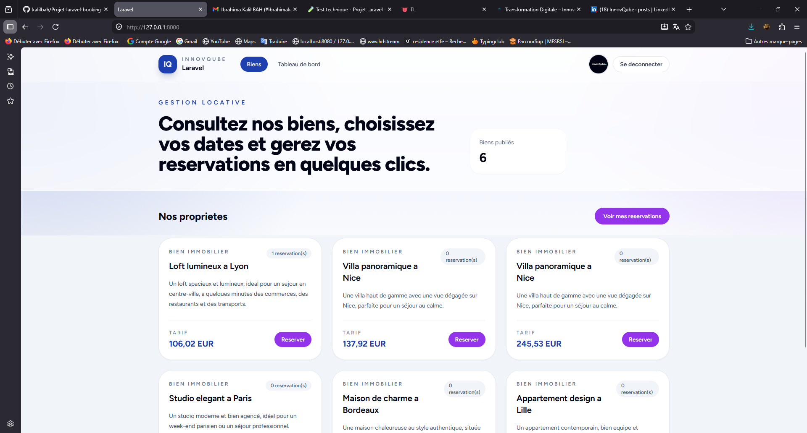

Cette page présente le catalogue public de l'application. Elle permet de visualiser rapidement les biens disponibles, d'accéder à leur fiche détaillée et d'orienter l'utilisateur vers la création de compte ou vers son espace personnel.

### Connexion client

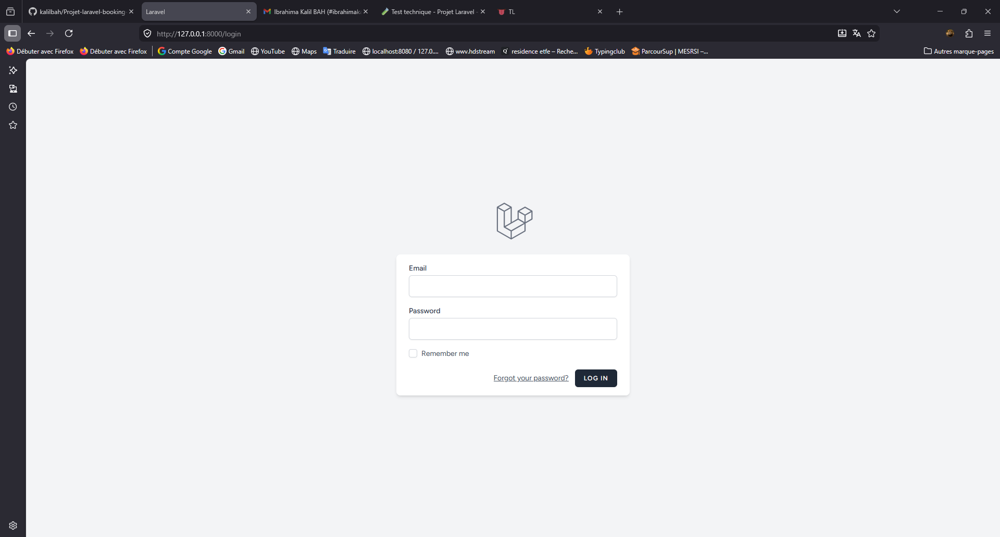

Cette interface permet à un utilisateur classique de se connecter à son compte. Elle constitue le point d'entrée vers l'espace membre, le suivi des réservations et la gestion du profil.

### Tableau de bord utilisateur

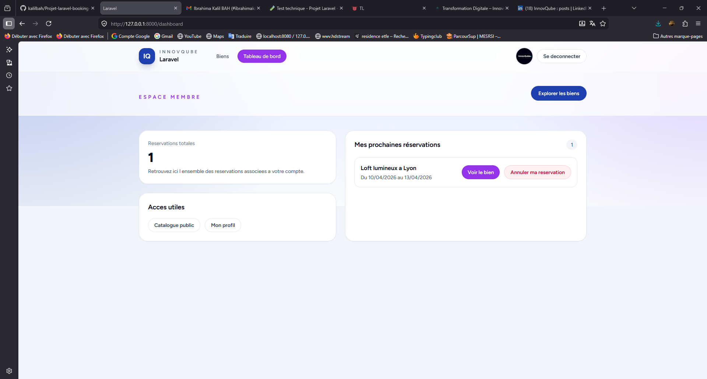

Cette page correspond à l'espace utilisateur. Elle centralise les réservations du client, propose des accès rapides vers le catalogue et le profil, et permet également d'annuler une réservation existante.

### Fiche détaillée et réservation

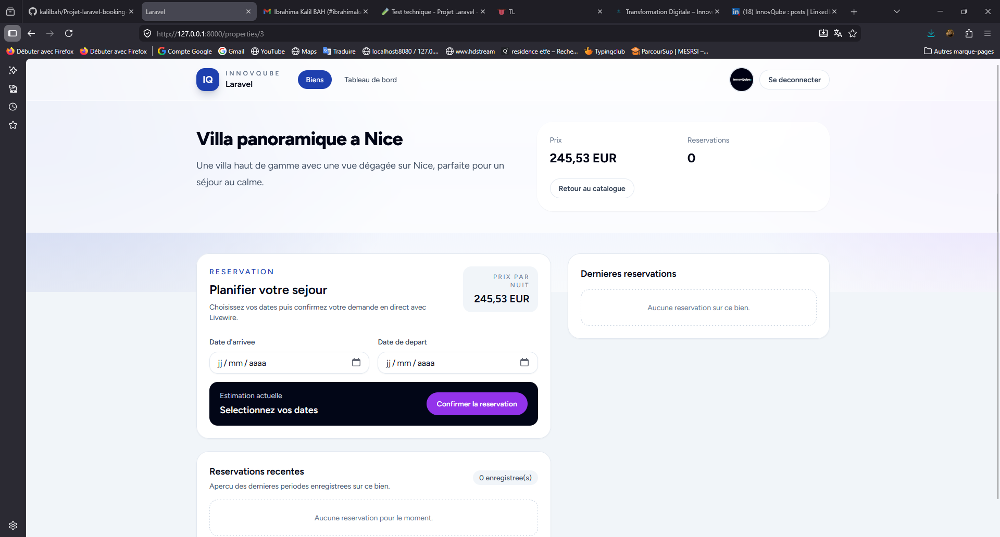

Cette page affiche le détail d'un bien immobilier ainsi que le module de réservation Livewire. L'utilisateur peut y sélectionner ses dates, obtenir une estimation du séjour et envoyer directement sa demande de réservation.

### Gestion du profil

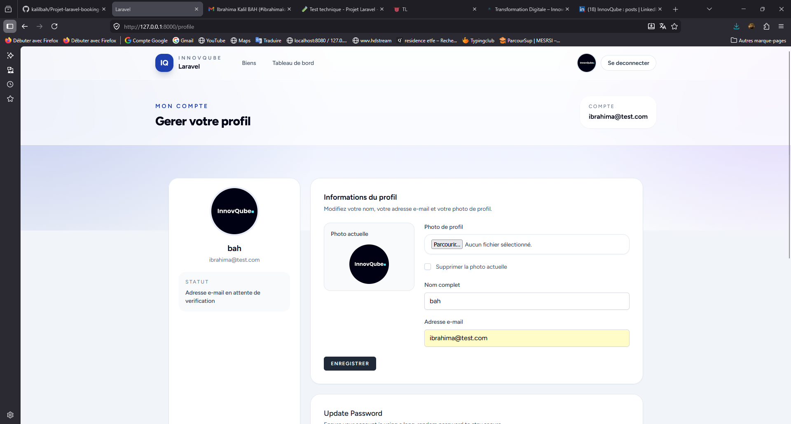

Cette page est dédiée à la gestion du profil utilisateur. Elle permet de modifier les informations personnelles, d'ajouter ou supprimer une photo de profil, et de gérer la sécurité du compte.

### Tableau de bord admin

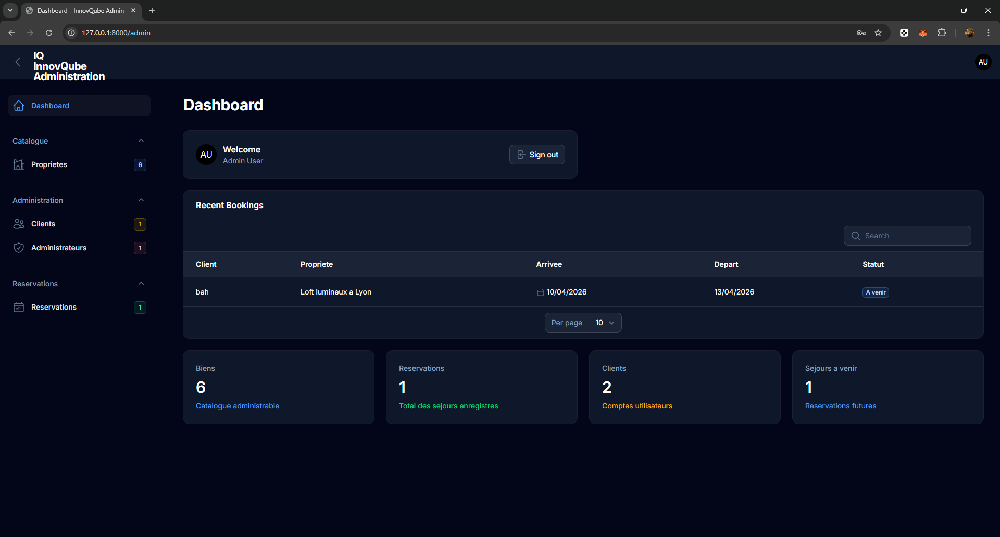

Cette page constitue l'accueil du panneau d'administration Filament. Elle rassemble les indicateurs essentiels de l'application, comme les statistiques globales et les réservations récentes.

### Interface administrateurs

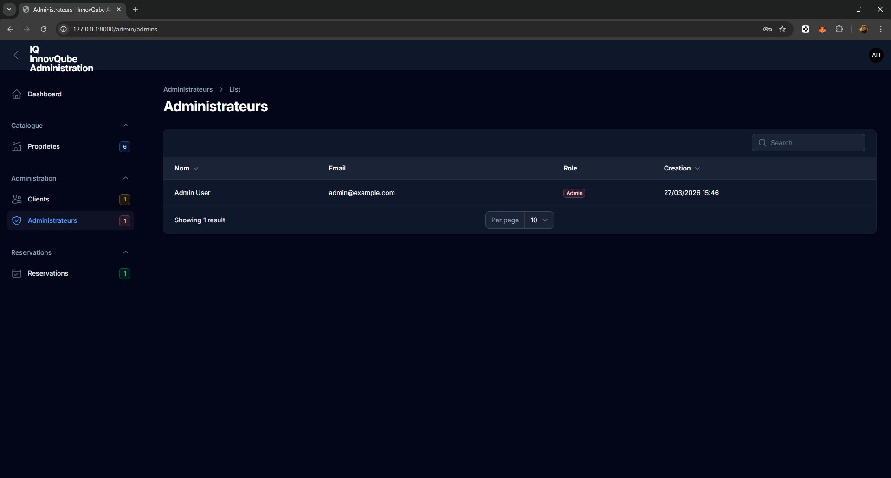

Cette vue liste les comptes administrateurs de l'application. Elle est volontairement en lecture seule afin de distinguer la consultation des administrateurs de la gestion des comptes clients.

### Gestion des clients par l'admin

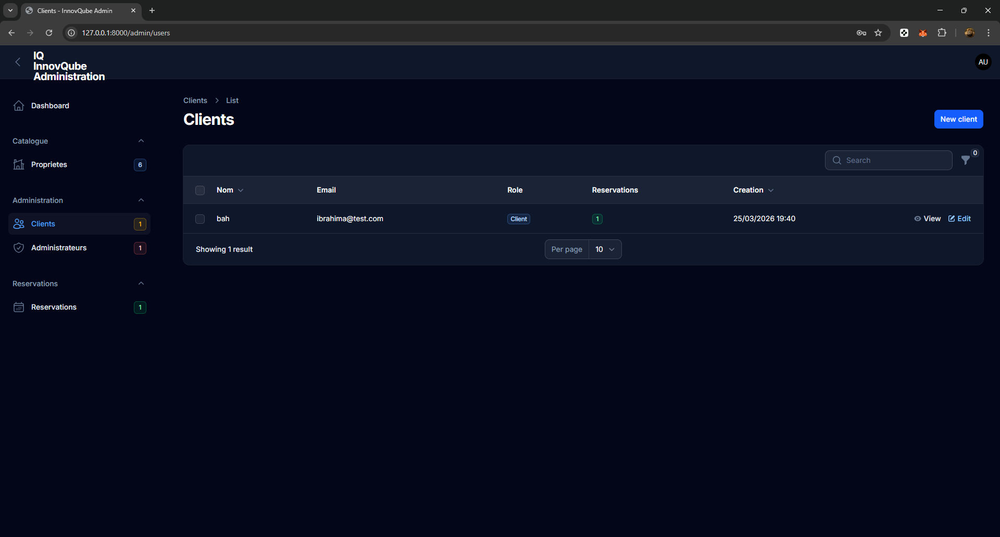

Cette page permet à l'administrateur de consulter les comptes clients existants, de les rechercher et d'accéder à leurs informations. Elle sert de point central pour la gestion des utilisateurs non administrateurs.

### Édition d'un client

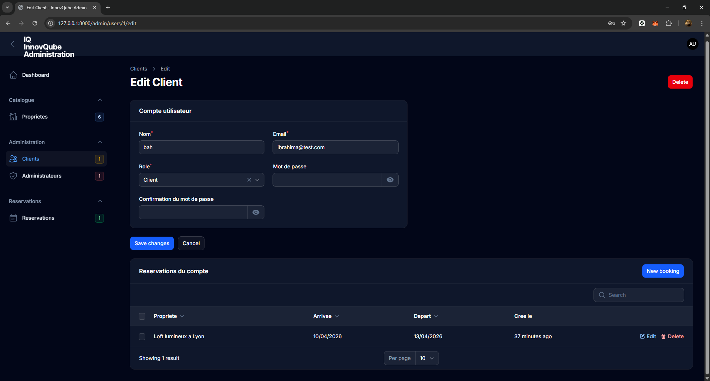

Cette interface permet de modifier les informations d'un client depuis l'espace d'administration. L'administrateur peut y mettre à jour les données du compte et suivre l'état général de l'utilisateur.

### Gestion des propriétés côté admin

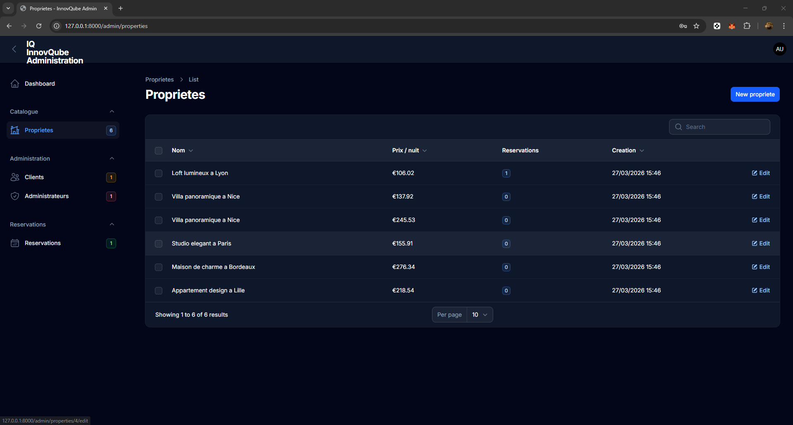

Cette page liste les biens immobiliers disponibles dans le panneau d'administration. Elle permet de gérer le catalogue, de consulter les entrées existantes et d'accéder aux opérations de modification.

### Édition d'une propriété

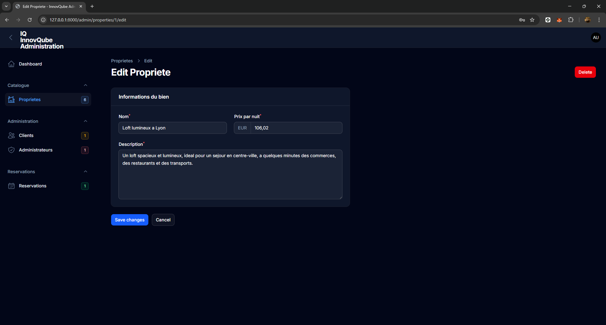

Cette page est dédiée à la modification d'un bien immobilier. L'administrateur peut y ajuster les informations descriptives, le tarif et l'ensemble des données nécessaires à l'affichage public du bien.

### Gestion des réservations côté admin

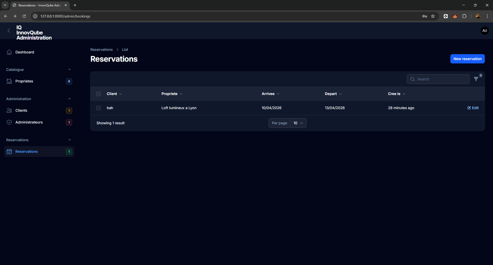

Cette vue permet à l'administrateur de consulter l'ensemble des réservations enregistrées dans l'application. Elle facilite le suivi global des séjours et le contrôle administratif des opérations en cours.

### Création d'une réservation par l'admin

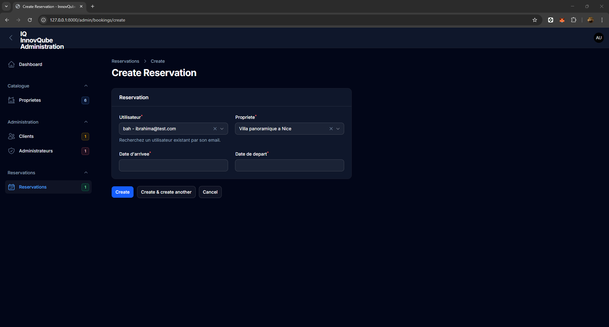

Cette interface permet à l'administrateur de créer une réservation manuellement. Il peut associer la réservation à un utilisateur existant en le recherchant par son adresse e-mail, puis sélectionner le bien et les dates concernées.

## Principaux fichiers modifiés ou ajoutés

### Backend

- `app/Models/User.php`
- `app/Http/Controllers/ProfileController.php`
- `app/Http/Controllers/Auth/AuthenticatedSessionController.php`
- `app/Http/Controllers/UserBookingController.php`
- `app/Http/Requests/ProfileUpdateRequest.php`
- `app/Http/Middleware/EnsureCustomer.php`
- `app/Livewire/BookingManager.php`
- `app/Providers/Filament/AdminPanelProvider.php`
- `app/Filament/Resources/UserResource.php`
- `app/Filament/Resources/AdminResource.php`
- `app/Filament/Resources/BookingResource.php`

### Routes

- `routes/web.php`

### Base de données

- `database/factories/PropertyFactory.php`
- `database/seeders/DatabaseSeeder.php`
- `database/migrations/2026_03_26_152144_create_properties_table.php`
- `database/migrations/2026_03_26_152200_create_bookings_table.php`
- `database/migrations/2026_03_27_164500_add_role_to_users_table.php`
- `database/migrations/2026_03_30_090000_add_profile_photo_path_to_users_table.php`

### Vues

- `resources/views/welcome.blade.php`
- `resources/views/layouts/navigation.blade.php`
- `resources/views/dashboard.blade.php`
- `resources/views/properties/show.blade.php`
- `resources/views/profile/edit.blade.php`
- `resources/views/profile/partials/update-profile-information-form.blade.php`
- `resources/views/livewire/booking-manager.blade.php`

### Assets

- `public/images/default-profile.svg`
- dossier `Screenshot/`

## Tests

```bash
php artisan test
```

## Résumé

À partir d'un projet Laravel vide, ce projet est devenu une application complète de réservations immobilières avec :

- authentification Breeze ;
- réservations dynamiques avec Livewire ;
- administration avec Filament ;
- séparation claire entre clients et administrateurs ;
- gestion de la photo de profil ;
- interface personnalisée en Blade et TailwindCSS.
